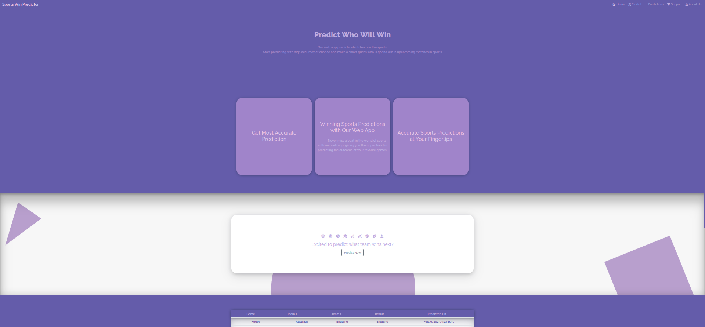
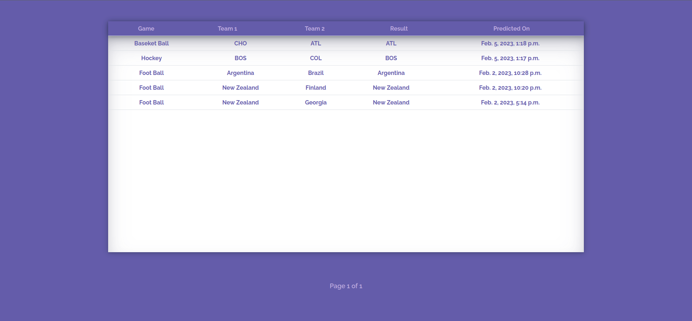

<h1>Predict Sports Winning Team</h1>

<h4>Predict what match wins next of your favourite sports</h4>

This is an machine learning sports win predictor web-app which predicts the winning team of the sport.

## Introduction

Welcome to the machine learning sports win predictor web-app! Our aim is to provide accurate predictions for the winning team in a sport. Using cutting-edge machine learning techniques, our web-app leverages historical data and real-time statistics to make predictions that are both reliable and user-friendly. Whether you're a die-hard fan or a casual observer, this web-app is sure to add a new dimension to your experience.

## Available Predictions 

- IPL
- Baseketball
- Football
- Hockey
- Asia World Cup
- Rugby

**Note: In feature updates, more sports will be added**

## Installation

``pip install -r requirements``

``python manage.py``

Tested on python version 3.10.4

## Data Sources

The data used to make predictions is sourced from https://kaggle.com/. The data was preprocessed and cleaned to ensure accuracy and reliability.

## Model Design

The machine learning model used in our web-app is a **xgboost** model.

## User Experience

Our web-app is designed with the user in mind. The user interface is intuitive and easy to use, allowing users to quickly access predictions and view historical data. 

## Future Plans

We are constantly working to improve our web-app and make it the best it can be. Our future plans include realtime prediction, improving accuracy, stopping prediction errors.

## Sports Predictor :

----

----

----

----

----

Tags: 

Sports win predictor web-app, cricket win predictor, IPL win predictor, Baseketball win predictor, football win predictor, Hockey win predictor, asia world cup win predictor, rugby win predictor, machine learning, prediction sports, web app